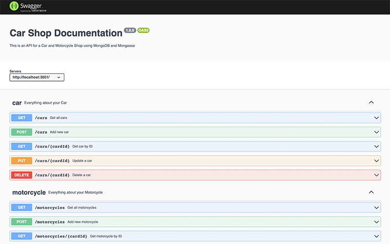

# Mongo Car Shop API

API with CRUD functionalities.

  - Built with Node, Express, Mongoose, Mongo DB, Typescript, and Docker  
  - 90%+ test coverage with Mocha, Chai, and Sinnon
  - Model, Service, Controller and OOP architecture
  
To run locally clone the repository and run ```npm run compose:up```
<br>


Acess the API documentation on ```http://localhost:3001/api-docs/```
<br>
<br>
</a>
